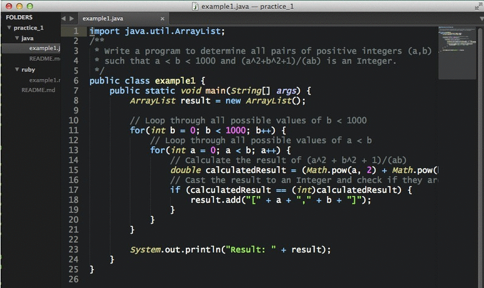
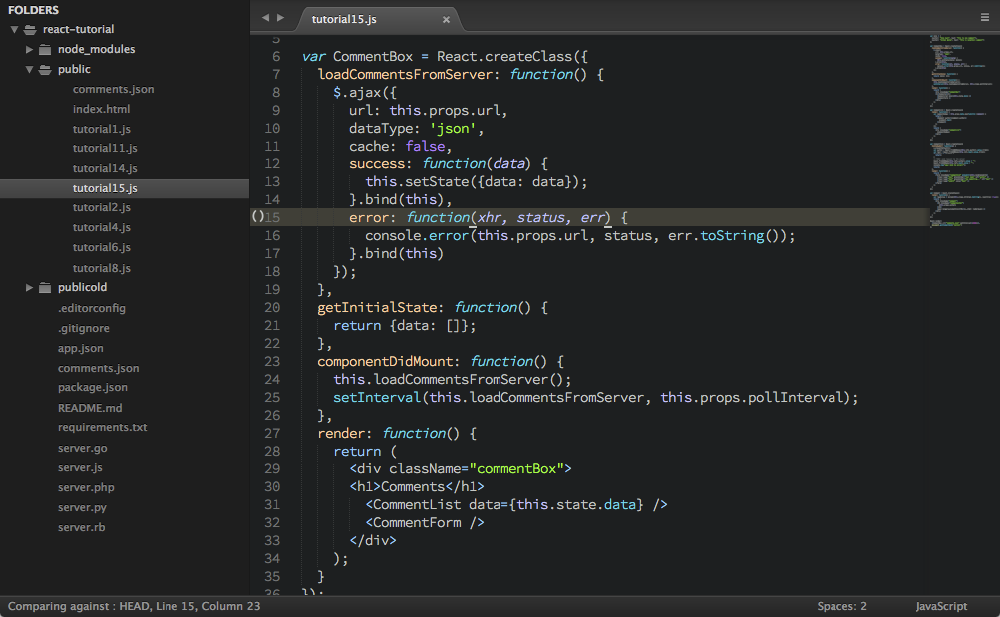

Atom-Dark.tmTheme
=================

#### Changes

Added two more themes **"Atom Dark Grey Text"** and **"Atom Dark Grey Text Green Cursor"** which have a closer text color match to original Atom Dark UI. The last one only makes the cursor deep green. [MR]

---

[Atom Dark UI](https://github.com/atom/atom-dark-ui) Port to .tmTheme for Sublime Text

First version:  


More atom like dark grey text:  


For the best experience I recommend pairing with the [Soda Dark](https://github.com/buymeasoda/soda-theme) theme and the [Lucida Console](http://www.ffonts.net/Lucida-Console.font) font.

#### Manual Installation

1. Download the `.tmTheme` file
2. *Browse Packages* from the Command Palette (`Ctrl+Shift+P` on Windows and Linux, `⇧⌘P` on OS X)
3. Copy the `.tmTheme` files to `Packages\User`
4. Activate the color in your preferences menu

#### Optional Cursor modifications

Add this lines to your user settings file to make your cursor bigger:

```
	"caret_extra_bottom": 2,
	"caret_extra_top": 2,
	"caret_extra_width": 3,
```
